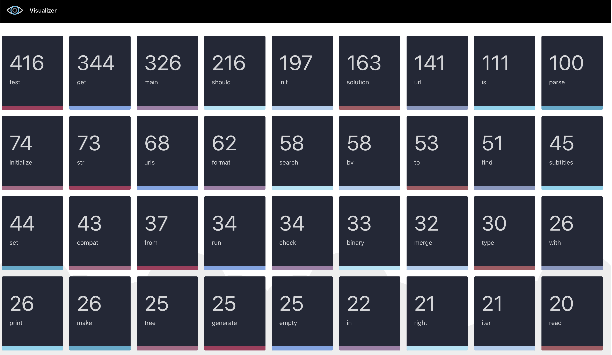

# Top used words in Python and Java function names

# I. Overview
This is tool to find the top used words used in ```Python``` and ```Java``` method or function names, 
of source code published on GitHub. To do this, two main components have been implemented. A miner, 
whose purpose is to collect data from GitHub; and a visualizer, which processes the data from 
the miner and shows the ranking of the words.

# 1. Miner
The miner has to interact with GitHub to retrieve Python and Java code from repositories. 
The miner is supposed to eventually process the entire GitHub repositories list. 
It follows a descending order of popularity, represented by the number of stars.

The execution of the miner begins by triggering such an action with ``` python3 etl.py ```, however, notice 
that a command line tool to mine the repositories was implemented, therefore some arguments could be included,
its usage is describes here below:

* Usage: ``` etl.py [-h] [-l LOWER_BOUND] [-u UPPER_BOUND] [-s STEP] [-j JAVA_PARSER] ```

    * ``` -l ``` Lower bound of the range of stars (default: 300)
    * ``` -u ``` Upper bound of the range of stars (default: 6000)
    * ``` -s ``` Step of the range of stars (default: 100)
    * ``` -j ``` Java parser to be selected (default: ```javalang```)


# 2. Visualizer

The visualizer has the purpose of processing the words collected by the miner. 
The work is done in real-time, meaning that the visualization needs to be refreshed as 
soon as new data is received from the miner.

The visualizer has been implemented as a web application, to be more specific, it is an Angular application.
The application can be accessed from a browser, and it is possible to appreciate the ranking of the words
as number cards, which are displayed in a grid.

After triggering the web service (```ng serve```) , the application will be ready to be used.
To access the application, the user needs to open the URL: ```http://localhost:4200```. This is only the case if 
the application is being manually executed for development purposes. If we are executing the docker container,
the URL will be: ```http://localhost:80/``` (See ```III. Execution```).



**Note:** Remember to install (```npm install```) the dependencies of the application, otherwise the application will not work.


---

# II. Packaging 

I wrote a ```docker-compose``` file to run the ```etl.py``` miner and the visualizer website as docker containers, 
moreover I wrote a ```Dockerfile``` for both components to build a Docker image with the miner and the visualizer.

# 1. Miner Docker file (```Miner/Dockerfile```)
 In this docker file I am defining the following tasks:

1. Updating and installing dependencies
2. Creating directories and defining the working directory
3. Copying files such as source code
4. Defining ```ENTRYPOINT``` to keep the docker container running

# 2. Miner Docker file (```Visualizer/Dockerfile```)
 In this docker file I am defining the following tasks:

1. Building stage in order to get the distribution of the application for production
2. Running stage in order to run the application
3. Moving elements from the first stage to the second stage in the correct directory

# 3. Docker compose (```docker-compose.yml```)

In this file I am defining the construction of the containers, the first one will be built depending 
on the ```Miner/Dockerfile``` and the second one will be built depending on the ```Visualizer/Dockerfile```.
Concerning the visualizer, I am opening the port 8080 to be able to access the application from a browser.

---


# III. Execution

Once we are in the root folder we should run the command ```docker-compose up -d``` and it will generate the two containers
based on the information within the ```docker-compose.yml``` file. We can access the application from the browser 
by opening the URL: ```http://localhost:80```. Moreover, since the Miner container is running in background,
we can have access to the container from the command line by running the command ```docker exec -it <NAME_CONTAINER> bash``` and
we can trigger the miner by running the command ```python3 etl.py```.

